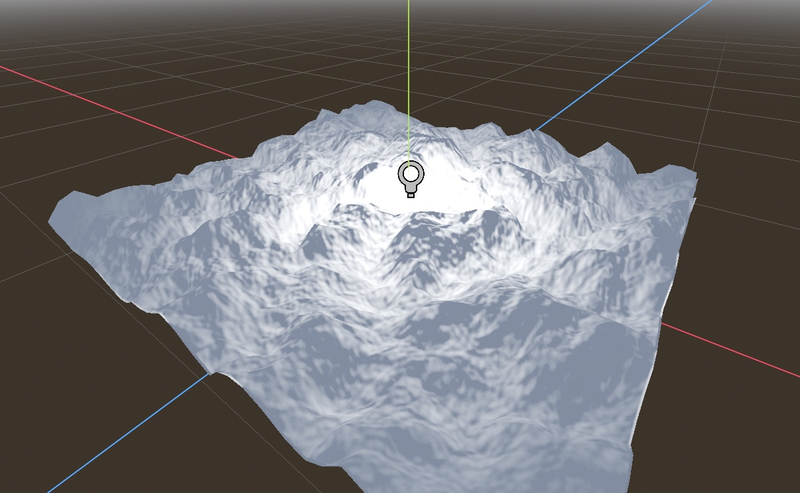
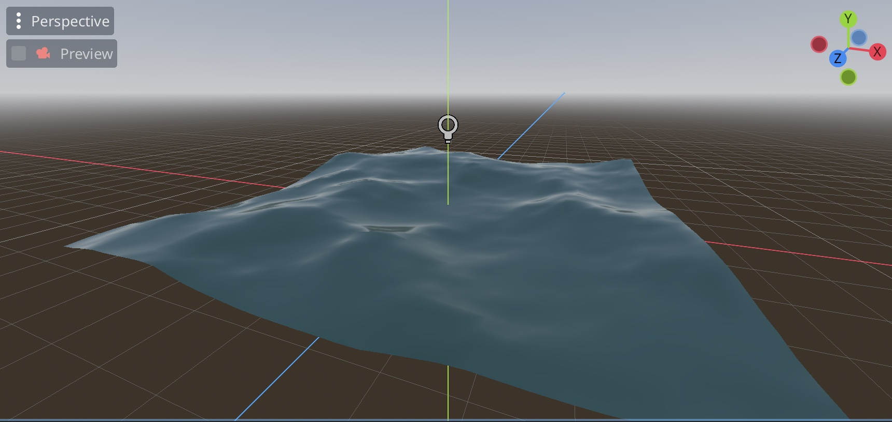
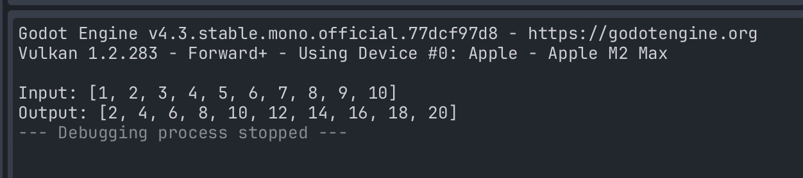

# Godot Shader tutorial
All completed godot shader tutorials. The tutorial scenes can all be seen in the Scenes Folder within the project.

## First Shader
Compiled in FirstShader.res, using shader1 in the shaders folder.

## Second Shader
Compiled in SecondShader.res, using shader2 in the shaders folder.

## Compute Shader
Compiled in compute_node.tcsn, using compute_example.glsl in the glsl_scripts folder

