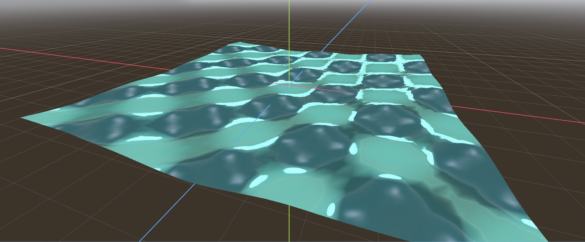

# Custom Shaders
Custom shader made expanding on the ocean shader made in tutorials, adding new vertex and fragment components.

The completed tutorials are all in the 'tutorial' branch on this repository.

## Vertex Shader
In addition to waves being made across the water, simmulates uniform ripples based on sine and cosine values to make symmetrical noice. This creates a dynamic mesh that waves over time.

## Fragment Shader
Added reflection based on view lighting, specular reflection based on light direction, and fresnel effect.

## How to Run
Clone the project, and open 'shadersproj' in godot. The custom shader is under 
customshader.res, and uses the shader CustomOceanShader.gdshader under the Scenes/Shaders folder. The shader is viewable in the godot view.

